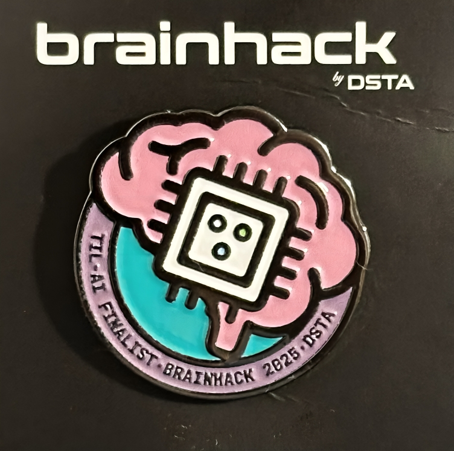
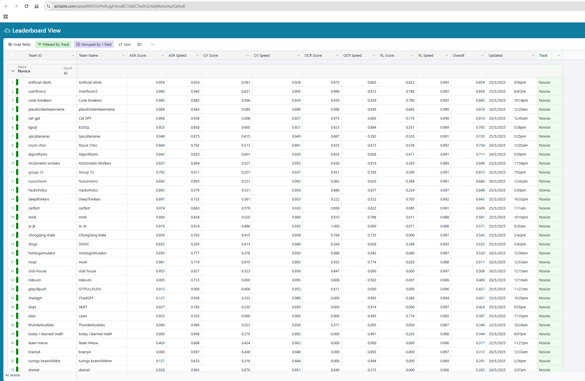

# 🏆 DSTA BRAINHACK 2025 TIL-AI 🚀

Welcome to our Team BJJSQL's repository for **DSTA Brainhack TIL-AI 2025**! 
This project showcases our collective effort in tackling a diverse set of AI and machine learning problems—from audio processing and computer vision to reinforcement learning and optimization in the hackathon.

We are proud to present our **innovative solutions** and the **cutting-edge models** we implemented.

📄 **Challenge Requirements:**
You can find the detailed specifications for each challenge [here on the official wiki](https://github.com/til-ai/til-25/wiki/Challenge-specifications).

 
<em>DSTA Brainhack Finalist Badge</em>

## 🏅 Competition Achievement

🎉 After a tough and gruelling fight, we are proud to have been placed under the **Top 8** teams at **TIL-AI 2025**!

 
<em>As the 6th ranked team in the online qualifiers, we secured our spot in the main event.</em>

## 🛠️ Technical Deep Dive

Below is a breakdown of the challenges we tackled and the technical methodologies we employed.

### 1. 🎤 Automatic Speech Recognition (ASR)

**Challenge:** Develop a high-accuracy, low-latency transcription system for real-time audio.

**Our Approach:** We engineered a lightweight and robust ASR pipeline by leveraging a state-of-the-art inference engine, model quantization, and a high-performance API server.

**Model Selection and Inference Optimization:** Our solution is centered around OpenAI's `whisper-small` model, converted for use with the `faster-whisper` library. This library is a reimplementation of Whisper built on **CTranslate2**, a highly optimized inference engine for Transformer models. This architecture provides significant speed improvements and reduced memory usage over standard PyTorch implementations. To further boost performance, we employ model quantization, dynamically selecting `float16` precision for GPU inference and `int8` for CPU, ensuring optimal speed in any environment.

**Robust Pre-processing:** To ensure broad compatibility, our system includes a robust pre-processing step. Using `soundfile` for audio decoding and `torchaudio` for transformations, the service automatically detects the input sample rate and resamples audio to the required 16,000 Hz. This makes the API resilient and capable of handling audio from various sources without client-side conversion.

**Final Score** 
- Accuracy: 0.925
- Speed: 0.858

### 2. 👁️ Computer Vision (CV)

**Challenge:** Detect specific objects in images with maximum speed and precision.

**Our Approach:** We built our solution on the powerful YOLOv8 architecture, creating a complete pipeline from data preparation and custom fine-tuning to a highly optimized, production-ready inference server.

**Data Preparation and Model Fine-Tuning:** The foundation of our accuracy lies in custom training. We developed a data-processing workflow to convert a standard COCO-annotated dataset into the YOLO format (`convert.ipynb`) and then systematically split it into training and validation sets (`split.ipynb`). By fine-tuning the YOLOv8 model on this specialized data (`train.py`), we tailored its feature extraction capabilities to excel at recognizing the specific objects in our domain.

**Inference Optimization for Deployment:** To achieve maximum speed, we implemented several key optimizations in our inference manager (`cv_manager.py`). The final trained model was optimized by:
* **FP16 (Half-Precision) Inference:** We converted the model to run in half-precision on CUDA-enabled GPUs (`model.to("cuda").half()`). This drastically reduces memory usage and leverages GPU Tensor Cores for a significant inference speedup with minimal impact on accuracy.
* **Layer Fusion:** We applied `model.fuse()`, an optimization that combines adjacent convolutional and batch normalization layers. This reduces the number of separate kernel executions, lowering computational overhead and further improving latency.

**Final Score**
- Accuracy: 0.605
- Speed: 0.921

### 3. 📄 Optical Character Recognition (OCR)

**Challenge:** Extract text from documents with diverse and complex layouts.

**Our Approach:**
We engineered a production-ready OCR pipeline using the `docTR` library, focusing on model selection and multi-layered performance optimization.

* **Optimized Model Architecture:** We selected a highly efficient two-stage pipeline from `docTR`. It uses a **LinkNet-ResNet18** architecture for fast and accurate text detection, followed by a lightweight **CRNN-MobileNetV3-Small** model for rapid text recognition. This combination is ideal for balancing high accuracy with low computational overhead.

* **Advanced Performance Tuning:** To meet stringent latency and throughput requirements, we implemented a robust optimization strategy:
* **GPU Acceleration with FP16:** The system automatically utilizes available CUDA GPUs and runs the model in **FP16 (half-precision)**. This technique cuts memory usage in half and leverages GPU Tensor Cores for a significant inference speedup.
* **Batch Processing:** The API is designed to handle multiple images in a single request. Our manager processes these as a batch, feeding them through the model in one forward pass, which is critical for maximizing throughput.
* **System Readiness:** A **model warm-up** routine is executed upon initialization to pre-load the model into memory and eliminate "cold start" latency, ensuring consistently fast responses from the very first API call.

**Final Score**
- Accuracy: 0.923
- Speed: 0.884

### 4. 🤖 Reinforcement Learning

**Challenge:** Design an autonomous agent to navigate a hostile, multi-agent environment.

**Our Approach:** We developed a robust training framework using a **Deep Q-Network (DQN)** architecture. Our strategy focused on custom reward shaping, sophisticated observation processing, and an alternating training scheme to teach both scout and guard agents effective behaviors.

* **Agent Architecture and Observation Processing:**
We designed a single, shared **CNN-based DQN** (`CNNDQN`) capable of learning policies for both scouts and guards. The model processes the agent's limited viewcone as an 8-channel image, allowing the CNN to extract critical spatial features. This visual data is then combined with auxiliary information (location, direction, etc.) to form a comprehensive state representation, enabling nuanced decision-making.

* **Advanced Reward Shaping (`RewardShapingWrapper`):**
A core component of our success was a custom environment wrapper that implemented sophisticated reward shaping. This provided dense, informative feedback to the agents beyond the sparse default rewards:
* **Scouts** are rewarded for exploring new tiles and penalized for idling or being seen by guards.
* **Guards** receive bonuses for moving towards visible scouts and are penalized for inactivity or moving away from their target. This incentivizes intelligent pursuit behavior.

* **Alternating Training Scheme and Experience Replay:**
To ensure both roles were trained effectively, our training loop (`train.py`) alternates between training a scout and a guard agent in each episode. We utilized a **Replay Buffer** and **Target Network** to stabilize learning. By training a single agent per episode while others act semi-randomly, we simplified the complex multi-agent credit assignment problem and fostered the emergence of specialized, role-specific strategies. The system continuously saves the best-performing models for each role, ensuring we deploy the most effective policies.

**Final Score**
- Accuracy: 0.551
- Speed: 0.989

### 5. 🧩 Surprise Challenge: Document Reassembly

**Challenge:** Reconstruct a shredded document from a set of vertical strips.

**Our Approach:**
We modeled this as a pathfinding problem, treating each strip as a node in a graph. The goal is to find the lowest-cost path that visits every node exactly once. Our high-performance solution combines a robust similarity metric with an efficient search algorithm.

* **Similarity Metric (Normalized Cross-Correlation):**
To measure how well two strips fit together, we calculated the dissimilarity between their adjacent pixel edges. We chose **Normalized Cross-Correlation (NCC)** as our core metric. Unlike simpler methods like Sum of Squared Differences (SSD), NCC is inherently robust to linear changes in brightness and contrast across the document, providing a much more reliable "cost" for connecting two strips.

* **Cost Matrix Generation:**
We pre-computed a complete N x N cost matrix where `cost[i, j]` stores the NCC-based dissimilarity between the right edge of strip `i` and the left edge of strip `j`. This allows for rapid lookups during the search phase.

* **Optimized High-Speed Beam Search Algorithm:**
An exhaustive search is computationally infeasible. Instead, we implemented a **Beam Search** algorithm, a powerful heuristic that balances exploration and exploitation. The algorithm starts with the best initial pairs and iteratively extends the `k` most promising partial sequences (the "beam"). By pruning less likely paths at each step, Beam Search efficiently navigates the vast search space to find a near-optimal solution well within the strict time constraints.

**Final Score**
- Accuracy: 0.985
- Speed: 0.978

### 6. 📦 Server & Deployment

**Challenge:** Package all models into a robust, deployable, and efficient offline system.

* **Containerization:** We used **Docker** to orchestrate our entire application. Each component (ASR, CV, etc.) was containerized independently. This ensured that dependencies were isolated and the system was easily reproducible. We used **multi-stage builds** in our Dockerfiles to create lightweight production images by excluding build-time dependencies.

* **API & Orchestration:** A central **FastAPI** server acted as the main entry point. It was responsible for receiving requests, routing them to the appropriate model container, and aggregating the results. This microservices-style architecture allowed us to manage each component independently.

* **Offline First & Optimization:** The entire system was designed to run offline. All models and dependencies were included in the Docker images. We applied inference optimization techniques not just at the model level but also at the server level, using asynchronous workers to handle multiple requests concurrently without blocking.

## 🧠 Reflections & Key Learnings

This hackathon was an intense and invaluable experience, pushing us to bridge the gap between theoretical models and practical, high-performance AI systems. Our journey through these five distinct challenges solidified several core engineering principles.

### AI Engineering Competencies

* **Performance Beyond the Model: The Primacy of Inference Optimization.**
A recurring theme across our ASR, CV, and OCR solutions was that a model's architecture is only the beginning. Achieving a winning combination of speed and accuracy required a deep focus on inference optimization. We learned that leveraging specialized engines like **CTranslate2** (`faster-whisper`), applying **FP16 quantization**, and using techniques like **layer fusion** (`model.fuse()`) are not optional tweaks but fundamental components of building deployable AI. These steps were directly responsible for a significant boost in our speed scores.

* **The Critical Role of Data and Customization.**
Off-the-shelf models provide a solid baseline, but true excellence comes from meticulous customization. Our work on the **Computer Vision** challenge, where we built a full data pipeline to convert, split, and fine-tune on a custom dataset, proved this. Similarly, in **Reinforcement Learning**, our most significant breakthroughs came from designing the `RewardShapingWrapper`—a testament to the power of domain-specific reward engineering to guide agent behavior more effectively than any generic algorithm alone.

* **Hybrid Systems and Algorithmic Thinking.**
The most elegant solutions often combine the strengths of different paradigms. Our approach to the **Surprise Challenge** is a prime example. Instead of forcing a deep learning solution, we framed it as a classic graph traversal problem. By combining a robust metric (**Normalized Cross-Correlation**) with an efficient search heuristic (**Beam Search**), we built a system that was both highly accurate and incredibly fast. This reinforced the idea that a strong foundation in classical algorithms is a superpower in the modern AI landscape.

### Software Engineering & MLOps Competencies

* **Production-Ready MLOps is a Necessity, Not an Afterthought.**
Managing five different models and their dependencies would have been impossible without a robust MLOps strategy. Our use of **Docker** for containerization and **FastAPI** to create lightweight, independent API servers was crucial. This microservices-style architecture not only kept our development process clean but also ensured that a failure in one component wouldn't cripple the entire system, a key principle of resilient system design.

* **Performance is a Feature: System-Level Optimization is Key.**
Writing clean code is important, but writing *performant* code is critical. This principle guided our server design. Implementing **batch processing** in our OCR server allowed us to maximize GPU throughput, while the **model warm-up** function eliminated "cold start" latency. Understanding how to leverage tools like **asynchronous programming and build lightweight containers** can make a huge difference in the final product. This holistic approach, combining model-level and system-level optimizations, was essential for achieving our high-speed scores.

## 🙌 Thank You!

Thank you for visiting our repository! We hope our work offers inspiration and valuable insights into solving complex AI challenges.

Feel free to ⭐ star, 🍴 fork, or reach out if you're interested in learning more or collaborating
